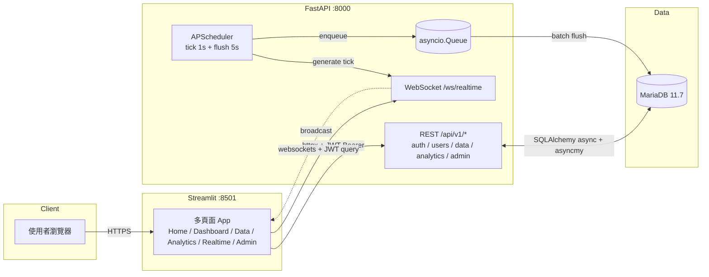
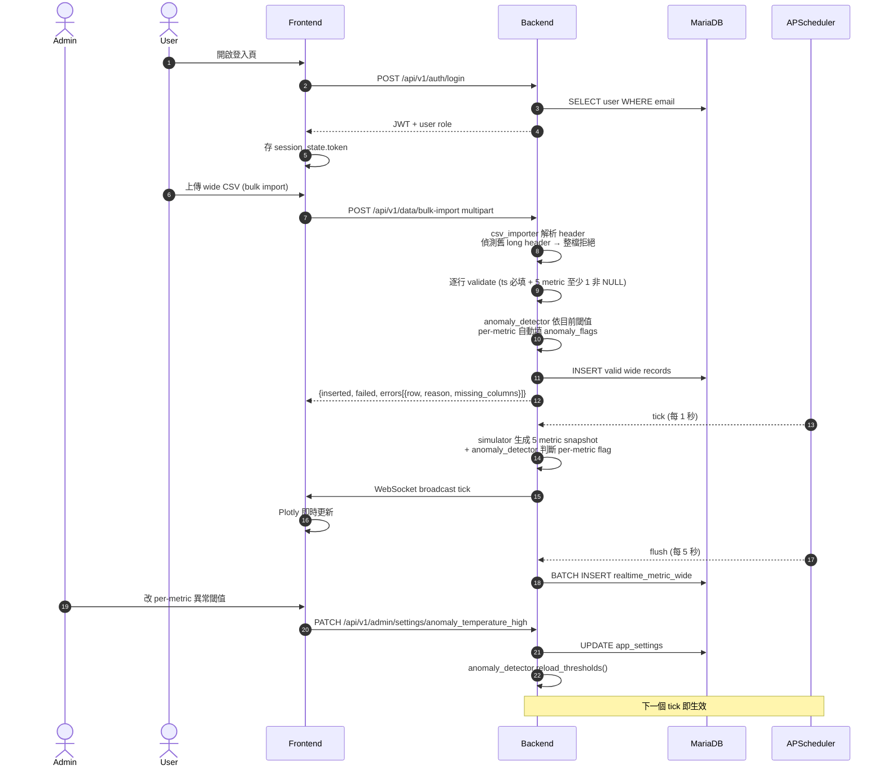
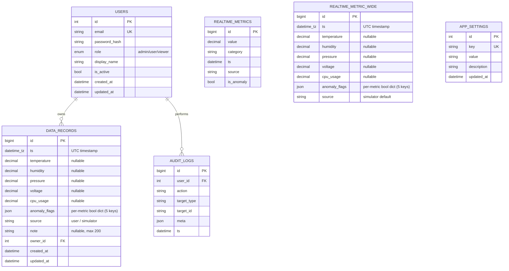
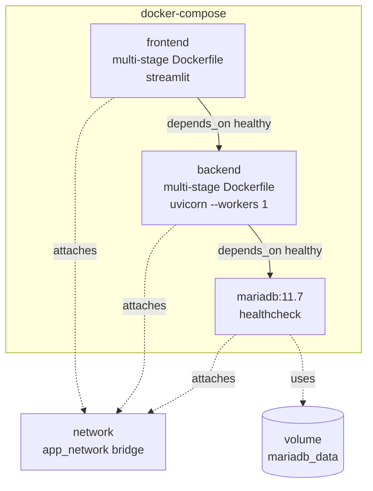

# 系統架構

## 整體拓樸

## 角色與資料流

## 資料庫 Schema（ER）

> **Wide schema 設計重點**
> - `DATA_RECORDS` 採 wide format：每筆 row 同時承載 5 metric snapshot，搭配 `anomaly_flags` JSON 做 per-metric 異常標記。
> - **CHECK constraint `ck_data_records_at_least_one_metric`**：強制 `temperature / humidity / pressure / voltage / cpu_usage` 至少 1 個非 NULL，DB 層阻擋空 row。
> - `anomaly_flags` 為 5 key 完整 bool dict（temperature / humidity / pressure / voltage / cpu_usage），由 `anomaly_detector` 依 `APP_SETTINGS` 的 per-metric 閾值即時計算。
> - `REALTIME_METRICS` 為 scope A 既有單 metric buffer 表（保留相容）；`REALTIME_METRIC_WIDE` 為高頻 simulator buffer，與 `DATA_RECORDS` 共用欄位設計，後台批次 flush。
> - Design Evolution：long format（title / value / category 單 metric per row）→ unified wide schema（多 metric per row + per-metric anomaly breakdown）。

## Docker 拓樸

## 模組責任邊界

| 模組 | 入口 | 主要檔案 | 對外 |
|---|---|---|---|
| 使用者管理 | `/api/v1/auth/*` + `/api/v1/users/*` | `app/services/auth_service.py` | JWT token + UserResponse |
| 資料管理 | `/api/v1/data/*` | `app/services/data_service.py` + `app/utils/csv_importer.py` | Wide schema CRUD（13 欄）/ bulk import / per-row error breakdown |
| 異常偵測 | `anomaly_detector` 服務 + `POST /api/v1/data/anomaly-preview` | `app/services/anomaly_detector.py` | per-metric 閾值載入 + bool dict 計算（5 key 完整）+ CSV 預覽不寫入 DB |
| 即時監控 | `/ws/realtime` + `/api/v1/admin/realtime-history` | `app/services/realtime_service.py` + `app/core/ws_manager.py` + `app/services/batch_writer.py` | WebSocket push + DB 批次寫入 `realtime_metric_wide` |
| 資料分析 | `/api/v1/analytics/*` | `app/services/analytics_service.py` + `app/utils/excel_exporter.py` | 統計 JSON（per-metric 聚合）+ Excel 串流 |
| 系統管理 | `/api/v1/admin/*`（含 `PATCH /admin/settings/{key}`）| `app/api/v1/admin.py` | 使用者 / 日誌 / DB 狀態 / per-metric 閾值動態調整 |
