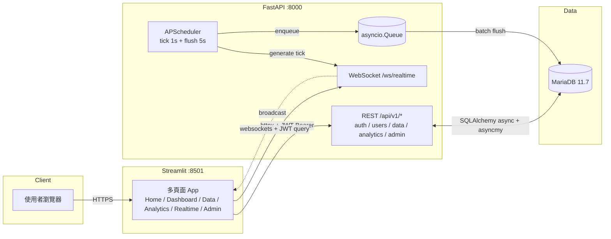
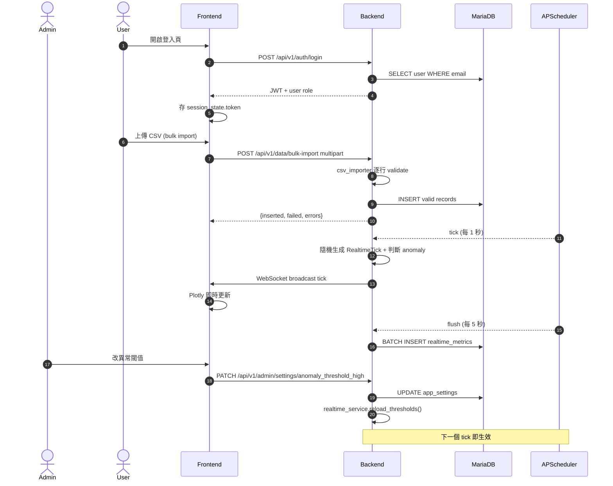
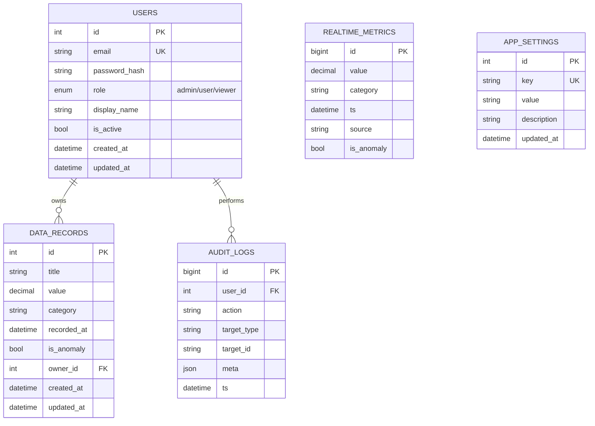
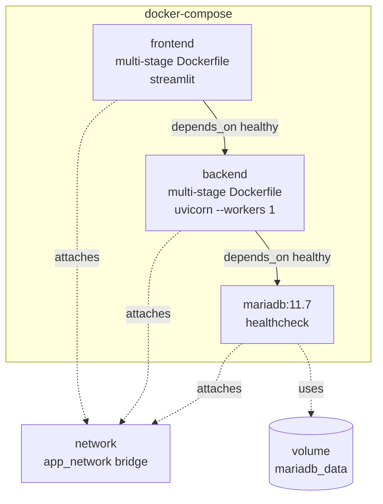

# 系統架構

## 整體拓樸

## 角色與資料流

## 資料庫 Schema（ER）

## Docker 拓樸

## 模組責任邊界

| 模組 | 入口 | 主要檔案 | 對外 |
|---|---|---|---|
| 使用者管理 | `/api/v1/auth/*` + `/api/v1/users/*` | `app/services/auth_service.py` | JWT token + UserResponse |
| 資料管理 | `/api/v1/data/*` | `app/services/data_service.py` + `app/utils/csv_importer.py` | CRUD / bulk import |
| 即時監控 | `/ws/realtime` + `/api/v1/admin/realtime-history` | `app/services/realtime_service.py` + `app/core/ws_manager.py` + `app/services/batch_writer.py` | WebSocket push + DB 批次寫入 |
| 資料分析 | `/api/v1/analytics/*` | `app/services/analytics_service.py` + `app/utils/excel_exporter.py` | 統計 JSON + Excel 串流 |
| 系統管理 | `/api/v1/admin/*` | `app/api/v1/admin.py` | 使用者 / 日誌 / DB 狀態 / 設定 |
